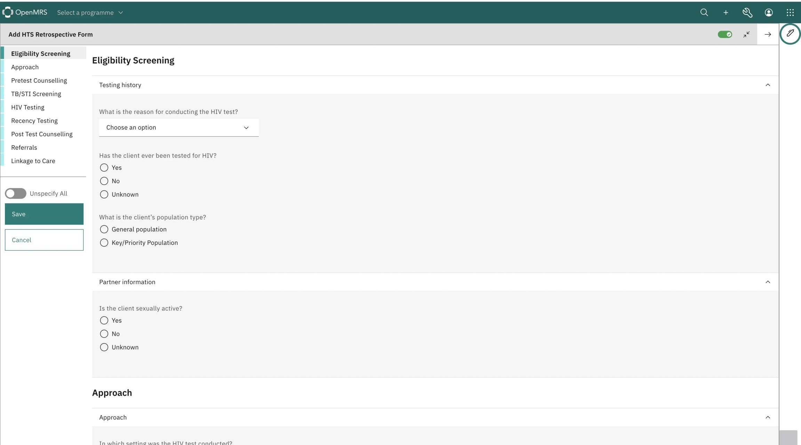

<div id="top"></div>

:wave: *New to O3? Be sure to review the [OpenMRS 3 Frontend Developer Documentation](https://o3-docs.openmrs.org/).* :teacher:

# OpenMRS ESM Form Engine Library




The OpenMRS Form Engine is a React library that enables the creation and rendering of standardized medical forms within the OpenMRS 3 (O3) ecosystem. It provides a flexible, JSON-based form schema system with built-in validation, conditional rendering, and multilingual support - making it ideal for complex healthcare data collection needs.

O3 form schemas are written in JSON and conform to the [O3 standard JSON schema spec](https://github.com/openmrs/openmrs-contrib-json-schemas/blob/main/form.schema.json) which defines the structure and constraints of the form data. The [O3 reference application](https://o3.openmrs.org/openmrs/spa) ships an embedded [Form Builder](https://github.com/openmrs/openmrs-esm-form-builder) that users can leverage to build forms interactively, using the interactive schema builder, or by writing code into the built-in JSON schema editor.

The Form Engine is a versatile library that can be integrated into any frontend module within the O3 ecosystem that requires form rendering capabilities. It's currently used in the following modules:

- [Form Builder](https://github.com/openmrs/openmrs-esm-form-builder) - where the form rendering in the Form Preview component is powered by the Form Engine
- [Patient Chart](https://github.com/openmrs/openmrs-esm-patient-chart) - specifically in the form engine wrapper app where the form engine is used to render clinical forms in the patient chart workspace

Key features of the Form Engine include:

- **Validation** - The form engine enables the validation of form data based on the form schema. Arbitrarily complex validation rules can be defined within the schema and evaluated by the form engine.
- **Subforms** - The form engine supports the rendering of subforms within a form. This allows for the creation of complex forms that can be reused across multiple forms.
- **Conditional rendering** - The form engine supports the conditional rendering of form fields based on the values of other form fields. This allows for the creation of dynamic forms that can adapt to the user's input.
- **Data sources** - The form engine supports the use of data sources to populate form fields. This allows for the creation of forms that can be populated with data from external sources.
- **Expression helpers** - The form engine supports the use of expression helpers to evaluate expressions within the form schema. This allows for the creation of complex expressions that can be evaluated by the form engine.
- **Translations** - The form engine supports translations for various elements such as action items, notifications, validators, and questions within the forms. Translations for pages, sections, and question labels are retrieved from the backend.
- **Drug orders** - The form engine facilitates drug orders by enabling the launch of the drug order basket. This feature allows users to add drugs along with medication details contained in the template for the specified drug.
- **Lab orders** - The form engine supports lab orders created using observations (obs) by utilizing the testOrders type on a specific question.
- **Markdown/ Read only fields** - The form engine includes support for read-only fields embedded within forms. These fields are utilized to provide additional information or guide users without allowing input.
- **Multiple form rendering modes** - The form engine provides several rendering modes that can be used to render forms in different contexts, including:
  - **Enter Mode** - This is the default mode that allows the user to enter data into the form. The form is rendered in a read-write mode.
  - **Edit Mode** - This mode allows the user to edit data that has already been entered into the form. The form is rendered in a read-write mode.
  - **View Mode** - This mode allows the user to view data that has already been entered into the form. The form is rendered in a read-only mode.
  - **Embedded View** - This mode is a condensed version of the `view mode` without the section headers and form actions. It can be used to display entered form data within a widget.

## Documentation

Read the full docs in the OpenMRS Wiki [here](https://openmrs.atlassian.net/wiki/spaces/projects/pages/68747273/O3+Form+Docs).

## Adding and Managing Translations

The Form Engine uses a combination of frontend and backend features to support translations.

- **Frontend translations** - Translations for static strings within the library are managed using Transifex, a localization platform that allows for the translation of strings. This repository being a library, the language specific translations are managed within the [esm-form-engine-app](https://github.com/openmrs/openmrs-esm-patient-chart/tree/main/packages/esm-form-engine-app) in the [Patient Chart](https://github.com/openmrs/openmrs-esm-patient-chart) repository and are loaded dynamically based on the user's locale.
- **Backend translations** - Translations for pages, sections, and question labels are retrieved from the backend. These are loaded automatically based on the concept translations as well as the form translation files included within the distribution.

You can read more about translations in the [OpenMRS Wiki](https://openmrs.atlassian.net/wiki/spaces/docs/pages/105512985/How+to+Translate+OpenMRS)

## Getting started

*NB: The Form Engine is a React library, not a standalone [O3 frontend module](https://openmrs.atlassian.net/wiki/spaces/docs/pages/151093806/Overview+of+Frontend+Modules). It can only be consumed by bundling it within a frontend module that incorporates it within a UI workflow.*

### Prerequisites

- [Node.js](https://nodejs.org/en/about/releases) 20 or later (LTS version recommended)
- [Yarn](https://yarnpkg.com/) 4.x or later (We use Yarn as our package manager)
- [Git](https://git-scm.com) (for version control)

### Installation

```bash
yarn add @openmrs/esm-form-engine-lib@latest
```

### Local development

#### Clone the repository

```bash
git clone git@github.com:openmrs/openmrs-esm-form-engine-lib.git
```

Or using https:

```bash
git clone https://github.com/openmrs/openmrs-esm-form-engine-lib.git
```

#### Install dependencies

```bash
yarn
```

#### Build the library

```bash
yarn build
```

#### Link the library to the consuming frontend module

To test your local Form Engine changes, you'll need to link the library to a frontend module that uses it (like Form Builder or Patient Chart). Here's how:

1. Build the library

```bash
yarn build
```

2. Copy the relative path to the built library

Copy the relative path to the built library by running the following command on Mac:

```bash
pwd | pbcopy # copy the path to form-engine-lib to the clipboard
```

Or the equivalent command on Linux:

```bash
# Copy the path to clipboard
pwd | xclip

# Link the library using the copied path
yarn link `xclip -o`
```

3. Symlink the library to the consuming frontend module

Then run the following command from the root of the consuming frontend module. For example, if you are working on the `openmrs-esm-form-builder` module, you would navigate to the root of the module and run:

```bash
yarn link `pbpaste` # paste the path to the openmrs-form-engine-lib where `pbpaste` is the command to paste the clipboard content
```

4. Run the consuming frontend module

After linking the library, run the relevant `start` command from the frontend module. For example, if you're working on the form builder module, you would run:

```bash
yarn start
```

Whereas for the patient chart you would have to start the Form Engine Lib frontend module like so:

```bash
yarn start --sources packages/esm-form-engine-app
```

You could also optionally proxy to a different backend where your forms are hosted by appending `backend` followed by the URL to the backend. For example:

```bash
yarn start --sources packages/esm-form-engine-app --backend https://link-to-my-backend.com
```

#### Troubleshooting linking issues

You might run into dependency version mismatches when attempting to link the library to the consuming frontend module. `@carbon/react` is a common culprit. If you see an error like this in your terminal after running `yarn link`:

```sh
@carbon/react@npm:1.74.0 [5ffd1] conflicts with parent dependency @carbon/react@npm:1.60.3 [faad]
```

That's because the consuming frontend module is using a different version of `@carbon/react` than the Form Engine Lib.

To resolve this, you set a `resolutions` field in your consuming frontend module's root `package.json` file to force the use of the same version of `@carbon/react` in the Form Engine Lib.

```json
"resolutions": {
  "@carbon/react": "1.60.3"
}
```

Once you've added the `resolutions` field, you'll need to run `yarn` again to install the dependencies. After that, you should be able to link the library to the consuming frontend module and run the consuming frontend module without any issues.

### Production

Note that in addition to this library, other form engine alternatives exist within the O3 ecosystem, including:

- [The HTML Form Entry module](https://github.com/openmrs/openmrs-module-htmlformentry)
- [The Angular Form Engine](https://github.com/openmrs/openmrs-ngx-formentry)

To use this library as the default form engine in your O3 instance, you will need to add this to your [spa-assemble-config.json](https://github.com/openmrs/openmrs-distro-referenceapplication/blob/main/frontend/spa-assemble-config.json) file:

```json
{
  "frontendModules": {
    // Add this line to the list of frontend modules
    "@openmrs/esm-form-engine-app": "next"
  }
}
```

**NB**: *If you are currently using the Angular Form Engine (@openmrs/esm-form-entry-app), you will need to remove it from your importmap and replace it with the Form Engine App (@openmrs/esm-form-engine-app). The two libraries are not compatible.*

### Report an issue

- [File an issue](https://github.com/openmrs/openmrs-esm-form-engine-lib/issues)
- [Post in the react-form-engine Slack channel](https://openmrs.slack.com/archives/C04QZ5DDVMG)

## Contributing

Contributions are what makes the open-source community such an amazing place to learn, inspire, and create. Any contributions you make are **greatly appreciated**. Read our [contributing guide](https://o3-docs.openmrs.org/docs/frontend-modules/contributing) for more information on how to contribute.

## License

Distributed under the MPLv2 with Healthcare Disclaimer License. See `LICENSE.txt` for more information.

<p align="right">(<a href="#top">Back to top</a>)</p>
