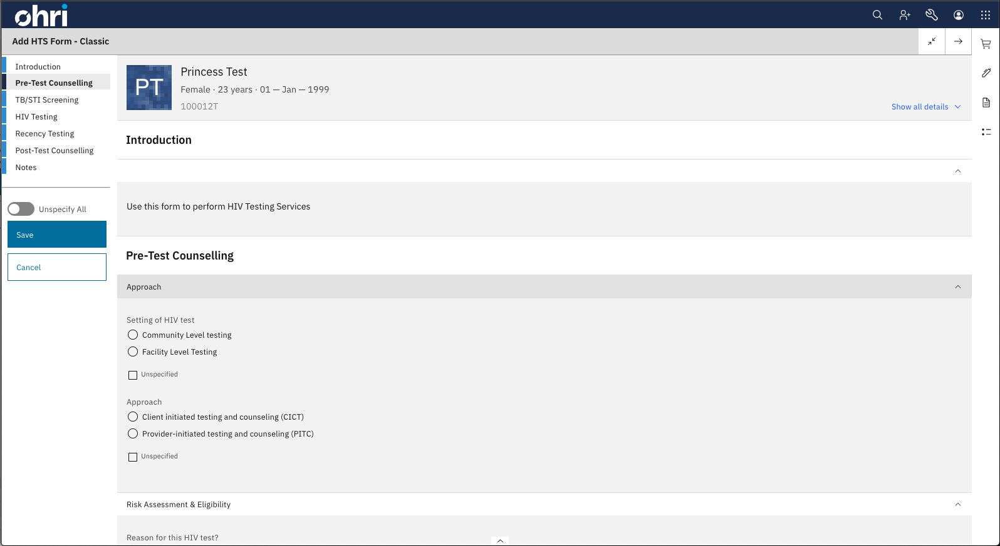

<div id="top"></div>

:wave:	*New to O3? Be sure to review the [OpenMRS 3 Frontend Developer Documentation](https://openmrs.github.io/openmrs-esm-core/#/). You may find the [Map of the Project](https://openmrs.github.io/openmrs-esm-core/#/main/map) especially helpful.* :teacher:	

[](https://github.com/UCSF-IGHS/openmrs-ohri-form-engine-lib/actions/workflows/node.js.yml)

<br/>

# OHRI Forms

[](https://ohri.atlassian.net/wiki/spaces/HOME/pages/120684546/OHRI+Forms)

<br/>

## About The Project

OHRI Forms is simply a React component that renders forms based on the AMPATH Forms Schema. The AMPATH forms are well defined [here](https://ampath-forms.vercel.app/).

### Documentation

You can find for more details, Technical guides, and other docs bundled within the [official documentation](https://ohri.atlassian.net/wiki/spaces/HOME/pages/120684546/OHRI+Forms).

### Built With


* [React.js](https://reactjs.org/)
* [Carbon](https://carbondesignsystem.com/)
* [O3 Framework](https://jquery.com)
* [Formik](https://formik.org/)
* [FHIR](https://om.rs/fhir)
* [OpenMRS WS/REST](https://wiki.openmrs.org/display/docs/REST+Web+Services+API+For+Clients)

<br>

## Getting Started

 *NB: OHRI Forms is a library and not an [O3 MF module](https://o3-dev.docs.openmrs.org/#/getting_started/tour). That being said, it can be consumed by bundling it within an ESM or custom frontend app that incorporates it within a UI workflow.*
### Prerequisites

You must have git, node, npm, and yarn installed. The versions required are
- The Node [Active LTS version](https://nodejs.org/en/about/releases/)
- The latest stable version of NPM
- The latest stable version of Yarn

### Installation

```bash
yarn add @ohri/openmrs-ohri-form-engine-lib@latest
```

<p align="right">(<a href="#top">back to top</a>)</p>

### Example Usage

```javascript
import React from 'react';
import { OHRIForm, OHRIFormSchema, SessionMode } from '@ohri/openmrs-ohri-form-engine-lib';
import { useFormsJson } from './forms-utils'

function FormRenderTest () {
    const { formJson, _ } = useFormsJson(...);

    // other declarations

    return <OHRIForm formJson={formJson} patientUUID={patientUUID} mode={SessionMode.ENTER} />;
}
```

## Contributing

Contributions are what make the open source community such an amazing place to learn, inspire, and create. Any contributions you make are **greatly appreciated**.

If you have a suggestion that would make this better, please fork the repo and create a pull request. You can also simply open an issue with the tag "enhancement".


*NB: You may have to [yarn link](https://classic.yarnpkg.com/en/docs/cli/link) your local installation of the project with a frontend app or ESM into order to view your local changes.*

### Report an issue
https://github.com/UCSF-IGHS/openmrs-ohri-form-engine-lib/issues


<!-- LICENSE -->
## License

Distributed under the MIT License. See `LICENSE.txt` for more information.

<p align="right">(<a href="#top">back to top</a>)</p>
